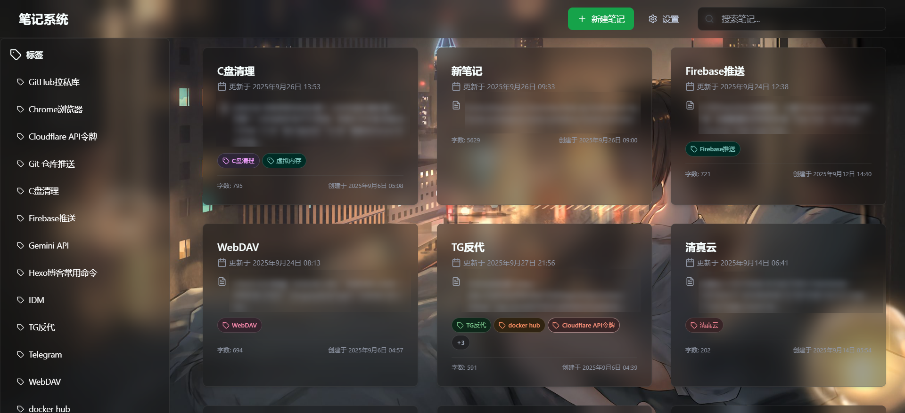
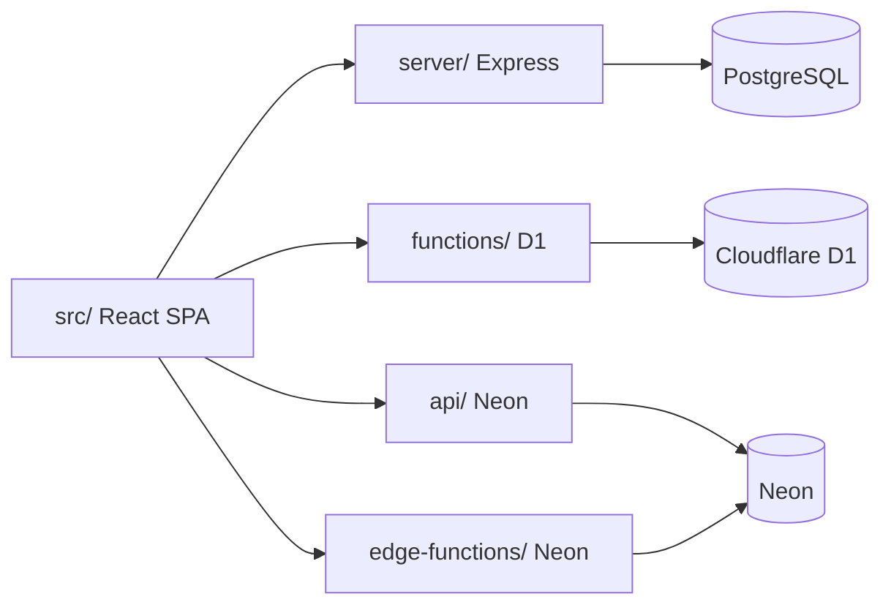

# 个人笔记系统

基于React的现代化Markdown笔记应用，支持客户端加密、多平台部署与多后端存储。

<p align="center">
  
</p>

<p align="center">
  <a href="https://reactjs.org/">
    
  </a>
  <a href="https://vitejs.dev/">
    
  </a>
  <a href="https://www.typescriptlang.org/">
    
  </a>
  <a href="https://github.com/zxlwq/notes">
    
  </a>
  <a href="https://pages.cloudflare.com/">
    
  </a>
  <a href="https://vercel.com/">
    
  </a>
  <a href="https://pages.edgeone.ai/">
    
  </a>
</p>



---

## 功能特性

| 类别 | 能力                                                           |
| ---- | -------------------------------------------------------------- |
| 编辑 | SimpleMDE编辑 + GFM预览；react-markdown + 代码高亮 + Mermaid   |
| 组织 | 标签、拖拽排序、高级搜索、列表分页与无限滚动                   |
| 安全 | 登录鉴权、客户端AES-GCM加密、JWT会话                           |
| 同步 | WebDAV/GitHub Gist / Cloudflare R2备份                         |
| 体验 | PWA 可安装、离线读写笔记、多标签页编辑冲突提示、移动端顶栏菜单 |
| 部署 | Cloudflare Pages、Vercel、EdgeOne Pages、Docker                |

---

## 技术栈

| 层级 | 选型                                                                     |
| ---- | ------------------------------------------------------------------------ |
| 前端 | React、TypeScript、Vite、Tailwind CSS                                    |
| 编辑 | SimpleMDE、react-markdown + remark-gfm + rehype-highlight                |
| 后端 | D1数据库 + PostgreSQL；Serverless / Edge Functions 适配多平台            |
| 共享 | `shared/`统一鉴权、笔记CRUD、备份、分页、迁移逻辑                        |
| 离线 | vite-plugin-pwa（可安装 + 静态预缓存）；IndexedDB 离线笔记库与待同步队列 |

### PWA与离线

生产环境须 **HTTPS**（如 [notes.zxlwq.dpdns.org](https://notes.zxlwq.dpdns.org/)）方可安装为 PWA；`npm run dev` 开发模式无 Service Worker。

| 项       | 行为                                                                                    |
| -------- | --------------------------------------------------------------------------------------- |
| 可安装   | manifest 含 `192×192` / `512×512` PNG（`public/icons/`）；`display: standalone`         |
| 静态壳   | JS/CSS/HTML、图标等由 Service Worker 预缓存，可离线打开应用界面                         |
| API 缓存 | `/api/*` 走 NetworkOnly（不缓存 API 响应）                                              |
| 离线读   | IndexedDB `notes-offline` 存全文；列表/详情/编辑可读已缓存笔记；搜索索引 `notes-search` |
| 离线写   | 新建/编辑/删除写入 IndexedDB 并入队；恢复联网后自动同步（底部 OfflineBar 提示）         |
| 详情加速 | IndexedDB 与列表 `updatedAt` 一致时跳过 API；否则先展示缓存再后台刷新                   |
| 更新     | 小版本自动刷新；**主版本号**变更时底部提示条，用户确认后刷新                            |
| Mermaid  | 独立 chunk，仅在详情页遇到 ` ```mermaid ` 代码块时按需加载                              |

**前提**：至少在线使用过一次以填充本地缓存；须保持登录态（JWT 在 localStorage）。

---

# 项目结构

## 总览

```
notes/
├── src/                      # React 前端 SPA
├── shared/                   # 多后端共享业务逻辑（Node ESM）
├── server/                   # Express 后端（本地 / Docker / 自托管）
├── api/                      # Vercel Serverless Functions
├── functions/                # Cloudflare Pages Functions（D1）
├── workers/                  # 独立 Cloudflare Workers（如 log-cron 定时任务）
│   └── log-cron/             # worker.js：D1 清理 + Cron；Pages 经 LOG_CRON 绑定调用
├── edge-functions/           # EdgeOne / Hugging Face 边缘函数（Neon）
├── public/                   # 静态资源（构建时复制到 dist/）
│   ├── icons/                # PWA 图标 192.png、512.png
│   ├── boot.js
│   └── _headers              # Cloudflare Pages 安全头
├── .github/workflows/        # CI/CD（Docker、备份、HF Spaces）
├── index.html                # Vite 入口 HTML
├── vite.config.ts            # Vite + PWA 配置
├── docker-compose.yml
├── Dockerfile
├── vercel.json               # Vercel 路由与构建
├── edgeone.json              # EdgeOne Pages 配置
└── .env.example              # 环境变量模板
```

## 前端 `src/`

```
src/
├── main.tsx                  # 应用入口、PWA 注册、离线同步、外观初始化
├── App.tsx                   # 路由与布局
├── index.css                 # 全局样式
├── vite-env.d.ts             # Vite / PWA 类型声明
│
├── pages/                    # 页面级组件（React Router）
│   ├── Login.tsx             # 登录 / 恢复码重置
│   ├── List.tsx              # 笔记列表、搜索、无限滚动
│   ├── View.tsx              # 笔记详情
│   ├── Edit.tsx              # 笔记编辑、多标签冲突检测、AI 助手
│
├── components/               # 业务组件
│   ├── Editor.tsx            # SimpleMDE 编辑器
│   ├── Editor.css
│   ├── Toolbar.tsx           # Markdown 格式工具栏
│   ├── ai/
│   │   └── Panel.tsx         # 编辑页 AI 助手（总结/建议/润色/扩写/续写/标签等）
│   ├── Settings.tsx          # 设置弹窗（外观、备份、密码）
│   ├── Modal.tsx             # 通用 / 确认 / 输入 / 选择模态框
│   ├── Advanced.tsx          # 高级搜索（标题/标签/正文）
│   ├── Card.tsx              # 笔记卡片
│   ├── Mermaid.tsx           # Mermaid 图表渲染
│   ├── OfflineBar.tsx        # 离线状态 / 待同步提示条
│   ├── SwUp.tsx              # PWA 主版本更新提示
│   ├── Protected.tsx         # 路由鉴权守卫
│   ├── BackTop.tsx           # 回到顶部
│   ├── Boundary.tsx          # 错误边界
│   │
│   ├── view/                 # 详情页子组件
│   │   ├── Bar.tsx           # 顶栏（移动端折叠菜单）
│   │   ├── Meta.tsx          # 标题、标签、时间元信息
│   │   └── Md.tsx            # Markdown 渲染（GFM + 高亮 + Mermaid）
│   │
│   ├── settings/             # 设置弹窗子模块
│   │   ├── Backup.tsx        # 导入 / 导出 / 云备份
│   │   ├── Pwd.tsx           # 改密 / 恢复码
│   │   ├── Recovery.tsx      # 恢复码一次性展示（复制 / 下载）
│   │   ├── Import.tsx        # 文件导入预览
│   │   ├── Logs.tsx          # 后端日志查看
│   │   └── logTr.ts          # 日志消息中文化
│   │
│   └── ui/                   # 通用 UI 原子组件
│       ├── Button.tsx
│       ├── Input.tsx
│       ├── Loading.tsx
│       └── Preload.tsx
│
├── lib/                      # 工具与 API 封装
│   ├── api.ts                # axios 客户端、notesApi / authApi / cloudApi
│   ├── ai.ts                 # aiApi、provider/model 本地记忆
│   ├── client.ts             # axios 实例（api / offlineSync 共用，避免循环依赖）
│   ├── edIns.ts              # 工具栏 / AI 编辑器插入与选区
│   ├── crypto.ts             # AES-GCM 加解密（内存密钥）
│   ├── session.ts            # JWT 会话读写
│   ├── notes.ts              # 列表摘要缓存（session/localStorage）
│   ├── offline.ts            # IndexedDB 离线笔记库与待同步队列
│   ├── offlineSync.ts        # 联网后刷新待同步队列
│   ├── search.ts             # 客户端高级搜索（按需拉正文）
│   ├── searchIdx.ts          # 搜索索引 IndexedDB（notes-search）
│   ├── markdown.ts           # GFM 预处理、编辑预览、rehype 插件
│   ├── backup.ts             # 导入导出格式转换
│   ├── reencrypt.ts          # 改密后全库重加密
│   ├── noteSync.ts           # 多标签页编辑锁 / BroadcastChannel
│   ├── listRefresh.ts        # 列表静默刷新间隔
│   ├── viewScroll.ts         # 详情页标签/高亮滚动
│   ├── utils.ts              # 通用工具（slugify、debounce 等）
│   └── webp.ts               # 背景图加载
│
├── hooks/
│   ├── Trap.ts               # 模态框焦点陷阱、Esc 关闭
│   ├── Modal.ts              # 模态框状态 hook
│   ├── Monitor.ts            # 性能/可见性监控
│   └── Storage.ts            # localStorage 封装
│
├── contexts/
│   └── Context.tsx           # 认证 Context（登录态、解锁）
│
└── types/
    └── index.ts              # Note、AppSettings、API 类型
```

## 共享层 `shared/`

四套后端共用的纯 Node 逻辑：

```
shared/
├── auth-node.js              # checkAuth（Cookie / Bearer JWT）
├── session.js                # JWT 签发/校验、恢复码哈希
├── notes.js                  # 笔记 DTO 映射、导入规范化
├── sql.js                    # PostgreSQL SQL 语句常量
├── pg-notes.js               # Express pool 笔记 CRUD + 分页
├── neon-notes.js             # Neon tagged-template 笔记 CRUD + replaceAllNotes
├── d1-notes.js               # Cloudflare D1 笔记 CRUD + 分页
├── d1-migrate.js             # D1 schema_migrations / 索引
├── d1-logRet.js              # D1 logs 过期清理
├── webdav.js                 # WebDAV 备份拉取/上传
├── gist.js                   # GitHub Gist API（fetch，四后端共用）
├── gist-store.js             # gist_id 存储（PG / D1 / Neon）
├── r2.js                     # R2 S3 签名与上传/下载
├── pagination.js             # page/limit 解析与响应封装
├── backup.js                 # Markdown ↔ JSON 备份解析
├── migrate.js                # schema_migrations 版本迁移
├── cors.js                   # CORS 解析（ALLOWED_ORIGINS / Origin 回显）
├── d1-pg-sync.js             # Cloudflare D1 → PostgreSQL 跨平台同步
├── logRet.js                 # logs 表过期清理
├── rateLimit.js              # 进程内滑动窗口限流
├── ai/                       # AI 代理（provider、prompt、Cloudflare REST/绑定）
│   ├── handlers.js           # getAiStatus / handleAiComplete
│   ├── providers.js
│   ├── models.js             # model 列表解析与白名单校验
│   ├── openai.js
│   ├── cloudflare.js
│   ├── cloudflare-binding.js
│   ├── prompts.js
│   ├── validate.js
│   └── complete.js
└── util.js                   # safeJsonParse 等工具
```

## Express 后端 `server/`

```
server/
├── index.js                  # Express 入口、CSP/HTTPS、静态 dist
├── context.js                # 数据库连接、initDatabase、鉴权中间件
├── routes/
│   ├── auth.js               # 登录、改密、恢复码、会话
│   ├── notes.js              # 笔记 CRUD + 分页
│   ├── backup.js             # WebDAV 备份
│   ├── gist.js               # GitHub Gist 备份
│   ├── r2.js                 # Cloudflare R2 备份
│   ├── order.js              # 笔记/标签排序持久化
│   ├── logs.js               # 日志查询与清空
│   └── ai.js                 # AI 状态与 completion 代理
└── services/
    ├── gist.js               # Gist API 调用
    └── r2.js                 # R2 S3 兼容 API 调用
```

## Vercel `api/`

文件路径即 HTTP 路由（Neon + `shared/` 薄适配）：

```
api/
├── _utils/                   # auth、pg 连接、session
├── _services/                # gist/r2 备份（对齐 server/services）
├── login.js / logout.js / session.js
├── password.js / password/status.js
├── recovery/status.js / setup.js / reset.js
├── notes.js / notes/[id].js
├── import.js / logs.js
├── backup.js / gist.js / r2.js
├── ai/status.js / ai/complete.js
└── order/[key].js
```

## Cloudflare Pages `functions/`

TypeScript Workers 风格，绑定 D1（`NOTESD`）：

```
functions/
├── types.ts
├── _utils/                   # auth、log、session
└── api/                      # 与 Vercel 路由一一对应
    ├── notes.ts / notes/[id].ts
    ├── login.ts / backup.ts / gist.ts / r2.ts
    ├── ai/status.ts / ai/complete.ts
    └── recovery/ …
```

## EdgeOne / HF `edge-functions/`

Neon 数据库 + 与 `api/` 同构的路由：

```
edge-functions/
├── _utils/
│   ├── auth.js / session.js
│   ├── log.js
│   └── logger.js             # 生产环境 trace() 静默日志
├── services/
│   ├── neonNotes.js          # 重导出 shared/neon-notes（兼容旧引用）
│   ├── gist.js               # Gist 备份/恢复（Neon）
│   └── r2.js                 # R2 备份/恢复（Neon）
└── api/                      # 路由结构同 api/，薄 HTTP 适配（含 ai/status、ai/complete）
```

## CI

```
.github/workflows/
├── docker.yml                # Docker 镜像构建推送
├── backup.yml                # 定时备份
└── notes-api.yml             # Hugging Face Spaces部署
```

## 架构

前端为统一SPA，按部署目标对接不同 API 目录：



| 目录              | 适用平台                                 |
| ----------------- | ---------------------------------------- |
| `server/`         | 本地开发、Docker、Render、Koyeb 等自托管 |
| `api/`            | Vercel                                   |
| `functions/`      | Cloudflare Pages                         |
| `edge-functions/` | EdgeOne Pages、Hugging Face Spaces       |

四套后端均复用 `shared/`，保证笔记、备份、鉴权行为一致。

---

# 客户端加密

启用加密后，标题、正文、标签在浏览器端 AES-GCM 加密后上传，服务端仅存密文。

- 加密密码在**当前标签页**内写入 `sessionStorage`（与 JWT 同生命周期）：刷新后自动解锁；关闭标签页、主动退出或自动锁屏后需重新输入
- 登录密码与加密密码可相同（登录时自动写入内存密钥）
- **改密码**：设置中修改密码会触发全库重加密，完成后需重新登录；请保持网络稳定
- 历史明文笔记在首次打开时自动迁移为密文

## 搜索与索引

笔记启用加密后，**服务端无法对正文做全文检索**（库中仅为密文）。搜索在浏览器本地完成：

- 解锁后后台将解密后的标题/标签/正文写入 **IndexedDB**（`src/lib/searchIdx.ts` → `notes-search`），避免每次搜索逐条 `GET /api/notes/:id`
- 在线浏览/保存时全文亦写入 **离线笔记库**（`src/lib/offline.ts` → `notes-offline`），供离线读写与详情加速
- 首次进入列表或搜索时会预热索引；保存/删除笔记会同步更新索引与离线库
- 退出登录会清空本地搜索索引与离线笔记库
- 搜索结果支持分页（`searchNotesPaged`）；正文建议项带 **snippet** 摘要

未加密部署理论上可在服务端做 FTS，但当前产品以客户端索引为主，与 E2E 加密模型一致。

---

## 忘记密码 / 恢复码

在设置 → 密码面板中可生成一次性恢复码（格式 `XXXX-XXXX-XXXX-XXXX`）。生成后请立即复制或下载 `.txt` 保存，关闭弹窗后无法再次查看。

| 步骤    | 说明                                                  |
| ------- | ----------------------------------------------------- |
| 1. 生成 | 设置 → 修改密码 →「生成恢复码」；重新生成会使旧码失效 |
| 2. 保存 | 复制到剪贴板或下载 `.txt`，离线妥善保管               |
| 3. 重置 | 登录页「忘记密码？使用恢复码」→ 输入恢复码与新密码    |

**重要限制**：恢复码仅能重置**登录密码**（服务端 `PASSWORD` / 数据库中的密码哈希）。客户端 AES 加密密钥随页面内存丢失，若未在改密前解锁并完成重加密，**已加密笔记内容无法通过恢复码找回**。

## 备份格式

| 格式     | 说明                                                                    |
| -------- | ----------------------------------------------------------------------- |
| JSON     | 完整对象数组（`id`、`title`、`content`、`tags`、时间戳），导入/导出推荐 |
| Markdown | 以 `---` 分隔，含 YAML 元数据                                           |
| 纯文本   | 仅标题与正文                                                            |

WebDAV / Gist / R2 云端备份均使用 **Markdown** 文件 `notes.md`（`parseBackupToNotes` 解析时也支持 JSON 数组格式）。

---

# 本地开发

## 环境要求

- Node.js 20+
- PostgreSQL 15+（或Docker启动数据库）

## 快速开始

```bash
git clone https://github.com/zxlwq/notes.git
cd notes
npm install
cp .env.example .env   # 填写 PASSWORD、DATABASE_URL
```

启动数据库（Docker 示例）：

```bash
docker compose up postgres -d
```

单终端启动前后端：

```bash
npm run dev
```

浏览器访问 `http://localhost:5173`（Vite HMR；`/api` 代理至后端 `http://localhost:3000`）。

仅需单独调试某一端时：

```bash
npm run dev:server   # 仅后端
npm run dev:client   # 仅前端
```

> 后端启动时会自动建表、执行 `shared/migrate.js` 版本迁移，并按 `LOG_RETENTION_DAYS`（默认 30 天）清理过期日志。

## 常用命令

| 命令                 | 说明                                 |
| -------------------- | ------------------------------------ |
| `npm run dev`        | 同时启动前后端（单终端）             |
| `npm run dev:client` | 仅 Vite 前端开发服务器               |
| `npm run dev:server` | 仅 Express 后端（读取 `.env`）       |
| `npm run build`      | 构建前端至 `dist/`                   |
| `npm run preview`    | 预览构建产物                         |
| `npm start`          | 生产模式后端（需先 `build`）         |
| `npm run check`      | 类型 + ESLint + Stylelint + Prettier |

## Docker 一键部署

```bash
docker compose up -d
```

应用默认 `http://localhost:3000`（内置 PostgreSQL + Express）。请在项目根目录 `.env` 中配置 `PASSWORD`、`JWT_SECRET`、`POSTGRES_PASSWORD`；启用 AI 时另配 `.env.example` 中 AI 相关变量（Docker Compose 已透传至容器）。

---

# API 摘要

| 方法            | 路径                         | 说明                                                     |
| --------------- | ---------------------------- | -------------------------------------------------------- |
| GET             | `/api/notes`                 | 笔记摘要列表（不含正文）                                 |
| GET             | `/api/notes?page=1&limit=30` | 分页列表，返回 `{ items, total, page, limit, hasMore }`  |
| GET             | `/api/notes/:id`             | 单条笔记（含正文）                                       |
| POST/PUT/DELETE | `/api/notes`                 | 创建 / 更新 / 删除                                       |
| POST            | `/api/import`                | 批量导入                                                 |
| GET/POST        | `/api/backup`                | WebDAV 云备份                                            |
| GET/POST        | `/api/gist`                  | GitHub Gist 备份                                         |
| GET/POST        | `/api/r2`                    | Cloudflare R2 备份（Pages 绑定桶；其它平台 S3 API）      |
| POST            | `/api/login`                 | 登录，返回 JWT                                           |
| POST            | `/api/logout`                | 退出登录                                                 |
| GET             | `/api/session`               | 查询当前会话是否有效                                     |
| POST            | `/api/password`              | 修改登录密码（需已登录）                                 |
| GET             | `/api/password/status`       | 密码存储来源（env / D1 / PostgreSQL）                    |
| GET             | `/api/recovery/status`       | 是否已配置恢复码                                         |
| POST            | `/api/recovery/setup`        | 生成恢复码（一次性返回明文，需已登录）                   |
| POST            | `/api/recovery/reset`        | 用恢复码重置密码（无需登录；有速率限制）                 |
| GET             | `/api/sync`                  | 查询 D1→PostgreSQL 同步是否已配置（Cloudflare Pages）    |
| POST            | `/api/sync`                  | 手动全量同步 D1 至 `DATABASE_URL`（需已登录）            |
| GET             | `/api/ai/status`             | AI 是否可用、provider 列表与 model 白名单（需已登录）    |
| POST            | `/api/ai/complete`           | AI 笔记助手（总结/建议/润色/扩写/续写/标签等；需已登录） |

所有写操作需携带有效会话（`Authorization: Bearer <token>` 或 Cookie）。`/api/login` 与 `/api/recovery/reset` 除外。

---

# 多平台部署

| 平台                | 数据库 | API 目录          | 必填配置                                                                                           | R2 备份（可选）             |
| ------------------- | ------ | ----------------- | -------------------------------------------------------------------------------------------------- | --------------------------- |
| Cloudflare Pages    | D1     | `functions/`      | `PASSWORD` + 绑定 `NOTESD`；可选绑定 `AI`（Workers AI）+ `CF_MODEL_NAME`；可选 `DATABASE_URL` 同步 | 绑定 R2 桶变量 `NOTESR`     |
| Vercel              | Neon   | `api/`            | `PASSWORD` + `DATABASE_URL`                                                                        | `ACCOUNT_ID` + R2 API Token |
| EdgeOne Pages       | Neon   | `edge-functions/` | `PASSWORD` + `DATABASE_URL`                                                                        | 同上                        |
| Hugging Face Spaces | Neon   | `server/`         | GitHub Actions 注入 env                                                                            | 同上                        |
| Docker / 自托管     | Neon   | `server/`         | `PASSWORD` + `DATABASE_URL`                                                                        | 同上（写入 `.env`）         |

## Cloudflare Pages

1. Fork 仓库，创建 D1 数据库 `notes`
2. 执行建表 SQL（见下方）
3. Pages 绑定 D1，名称 `NOTESD`
4. 设置环境变量 `PASSWORD` + `JWT_SECRET` 部署
5. **（可选）AI**：Pages → Settings → Functions → Bindings → **Workers AI**，变量名 `AI`；再设环境变量 `CF_MODEL_NAME`（如 `@cf/meta/llama-3.1-8b-instruct`）。绑定方式无需 `CF_API_KEY`；未绑定时可改用 REST（`CF_API_KEY` + `CF_ACCOUNT_ID` + `CF_MODEL_NAME`）
6. **（可选）跨平台同步**：在 [Neon](https://neon.tech/) 创建数据库，将连接串写入Pages环境变量 `DATABASE_URL`。D1仍为读写主库；笔记、密码设置、排序等变更会异步同步至PostgreSQL。迁移到Vercel/Docker时复用同一 `DATABASE_URL` 即可保留数据
7. **PWA**：自定义域名已启用 HTTPS 时，Chrome/Edge 可「安装应用」；离线新建笔记同步时 POST 支持客户端 `id`（与 `shared/d1-notes.js` upsert 对齐）

```sql
CREATE TABLE IF NOT EXISTS settings (
  key TEXT PRIMARY KEY, value TEXT, updated_at TEXT
);
CREATE TABLE IF NOT EXISTS notes (
  id TEXT PRIMARY KEY, title TEXT, content TEXT, tags TEXT,
  created_at TEXT, updated_at TEXT
);
CREATE TABLE IF NOT EXISTS logs (
  id INTEGER PRIMARY KEY, level TEXT, message TEXT NOT NULL,
  meta TEXT, created_at TEXT DEFAULT (datetime('now'))
);
CREATE TABLE IF NOT EXISTS order_data (
  key TEXT PRIMARY KEY, value TEXT, updated_at TEXT DEFAULT (datetime('now'))
);

-- 性能索引（也可由 API 首次访问时通过 shared/d1-migrate.js 自动创建）
CREATE INDEX IF NOT EXISTS idx_notes_updated_at ON notes(updated_at DESC);
CREATE INDEX IF NOT EXISTS idx_logs_created_at ON logs(created_at DESC);
```

R2备份（可选）：在Pages **绑定R2存储桶**，绑定变量名 **`NOTESR`**（名称可自定）。使用Workers原生R2绑定，**无需**配置 `ACCOUNT_ID` / API Token。

**同步说明**：配置 `DATABASE_URL` 后，写操作（增删改笔记、导入、云备份恢复、改密等）会通过 `waitUntil` 异步推送全量快照至PostgreSQL。也可调用 `POST /api/sync` 手动触发。同步范围：`notes`、`settings`（含密码哈希/恢复码）、`order_data`（不含 `logs`）。

- **冲突策略**：以 **D1为唯一写入源**；PG仅接收D1全量快照，同id/key行被覆盖，D1 中已删行在PG侧同步删除。
- **失败重试**：后台同步失败时自动重试最多 3 次；仍失败则打日志，可 `POST /api/sync` 手动补偿。

1. **部署Worker日志清理** [worker.js](#cloudflare-r2-备份) 绑定与Pages相同的 D1

2. **Pages 绑定 Worker** Pages 项目 → **Settings → Functions → Service bindings**：
   - 变量名：`LOG_CRON`
   - 服务：`notes-log-cron`

3. Pages 环境变量：`TOKEN`（可选，与 Worker 一致）、`LOG_RETENTION_DAYS`（默认 7）

Worker 每日 UTC 03:00 自动清理；Pages 经 Service Binding 调用 `/api/cron/logs` 时走内网转发至 Worker。仍可在设置页或已登录 `POST /api/logs` 手动清理。

## Vercel

1. 创建 Neon 数据库，获取 `DATABASE_URL`
2. 导入仓库，配置 `PASSWORD`、`DATABASE_URL`
3. （可选）配置 R2 备份：见下方 [Cloudflare R2 备份](#cloudflare-r2-备份)
4. 部署

## EdgeOne Pages

1. 创建 [Neon](https://neon.tech/) 数据库
2. 连接 GitHub 仓库，配置 `PASSWORD`、`DATABASE_URL`；可选 `LOG_RETENTION_DAYS`（默认 7）
3. （可选）配置 R2 备份：见下方 [Cloudflare R2 备份](#cloudflare-r2-备份)
4. 部署（`edgeone.json` 的 `schedules` 每日 UTC 03:00 调用 `/api/cron/logs` 清理过期日志）

> EdgeOne 定时任务无法附带 `Authorization`。若设置了 `TOKEN`，平台 Cron 会 401；可用外部 Cron 带 `Bearer`，或暂时不设 `TOKEN`。

## Hugging Face Spaces

使用 [.github/workflows/notes-api.yml](.github/workflows/notes-api.yml) 通过 GitHub Actions 创建 Docker Space，并注入 `PASSWORD`、`JWT_SECRET`、`DATABASE_URL` 等环境变量（生产环境 `JWT_SECRET` 必填，与登录密码独立）。可选在 workflow 的 `r2_config` 输入中注入 R2 API Token（格式见 workflow 注释）。

### Docker / 自托管

与[本地开发 · Docker 一键部署](#docker-一键部署)相同。生产环境请在 `.env` 中配置 `PASSWORD`、`DATABASE_URL`，并按需填写 WebDAV / Gist / R2 变量（见 [.env.example](.env.example)）。

## Cloudflare R2 备份

R2 可在**任意部署平台**使用，但接入方式分两种：

| 部署方式                      | 配置方法                                                    | 说明                                                                       |
| ----------------------------- | ----------------------------------------------------------- | -------------------------------------------------------------------------- |
| **Cloudflare Pages**          | 绑定 R2 桶，绑定变量名 `NOTESR`                             | `functions/api/r2.ts` 通过 `env.NOTESR` 读写；桶名称可自定义，无需 S3 密钥 |
| **Vercel / EdgeOne / Docker** | 环境变量 `ACCOUNT_ID`、`ACCESS_KEY_ID`、`SECRET_ACCESS_KEY` | `shared/r2.js` 通过 R2 **S3 兼容 API** 访问名为 **`notes`** 的桶           |

**其它平台配置步骤**（Vercel、EdgeOne、Docker 等）：

1. 创建 R2 API Token（需对该桶具备读写权限），记录 Access Key ID 与 Secret Access Key
2. 在部署平台配置环境变量：
   - `ACCOUNT_ID` — Cloudflare 账户 ID（Dashboard 右侧可见）
   - `ACCESS_KEY_ID` — R2 API Token 的 Access Key
   - `SECRET_ACCESS_KEY` — R2 API Token 的 Secret Key
3. 确保运行环境能出站访问 `https://<ACCOUNT_ID>.r2.cloudflarestorage.com`

备份文件固定为桶内 `notes.md`（Markdown）。设置页「Cloudflare R2 → 上传到 R2 / 从 R2 下载」调用 `GET/POST /api/r2`。

---

# 环境变量

完整示例见 [.env.example](.env.example)。

| 变量                                                 | 必填 | 说明                                                                                                         |
| ---------------------------------------------------- | ---- | ------------------------------------------------------------------------------------------------------------ |
| `PASSWORD`                                           | ✅   | 登录密码（所有平台）                                                                                         |
| `JWT_SECRET`                                         | ✅   | 会话JWT签名密钥（独立随机串，**勿与 `PASSWORD` 相同**）                                                      |
| `DATABASE_URL`                                       | ✅   | PostgreSQL/Neon连接串；Cloudflare Pages可选，用于 D1→PG 同步                                                 |
| `SESSION_TTL_SEC`                                    | ❌   | 会话JWT有效期（秒），默认 604800（7 天）                                                                     |
| `ALLOWED_ORIGINS`                                    | ❌   | 生产CORS白名单（逗号分隔）；未设置则回显 Origin                                                              |
| `LOG_RETENTION_DAYS`                                 | ❌   | 日志保留天数，默认 30（Express / Pages / Cron 端点）                                                         |
| `TOKEN`                                              | ❌   | `/api/cron/logs` Bearer 密钥；Vercel Cron；CF Pages/Worker；EdgeOne 平台 Cron 无法附带（见部署说明）         |
| `DEBUG`                                              | ❌   | Edge函数调试日志（`true` 开启）                                                                              |
| `WEBDAV_URL/USER/PASS`                               | ❌   | WebDAV 备份                                                                                                  |
| `GIT_TOKEN`                                          | ❌   | GitHub Gist 备份                                                                                             |
| `ACCOUNT_ID`                                         | ❌   | R2 账户 ID（**非 Pages** 平台 S3 API 备份必填其一组）                                                        |
| `ACCESS_KEY_ID`                                      | ❌   | R2 API Token Access Key                                                                                      |
| `SECRET_ACCESS_KEY`                                  | ❌   | R2 API Token Secret Key                                                                                      |
| `AI_PROVIDER`                                        | ❌   | 提供商白名单（`openai` / `ark` / `kilo` / `cf` / `zhipu` / `gh`）；留空=全部已配置项；多个用逗号或 `\|` 分隔 |
| `OPENAI_*` / `ARK_*` / `KILO_*` / `ZHIPU_*` / `GH_*` | ❌   | 各 OpenAI 兼容提供商的 Key、Base URL、Model（见 `.env.example`）                                             |
| `CF_API_KEY` / `CF_ACCOUNT_ID` / `CF_MODEL_NAME`     | ❌   | Cloudflare Workers AI **REST**（Docker/Express 等）；Pages 可改绑 `AI`                                       |
| `AI_RATE_LIMIT_MAX`                                  | ❌   | AI 请求每 IP 限流次数，默认 20                                                                               |
| `AI_RATE_LIMIT_WINDOW_SEC`                           | ❌   | AI 限流窗口（秒），默认 3600                                                                                 |
| `AI_MAX_INPUT_CHARS`                                 | ❌   | 单次 AI 请求正文上限，默认 32000                                                                             |

> **AI**：编辑页「AI 助手」调用 `/api/ai/*`，Key 仅存服务端；面板可切换已配置的 provider 与 model（`AI_PROVIDER` 白名单 / `*_MODEL_NAME` 逗号列表）。Cloudflare Pages 推荐绑定 Workers AI（变量 `AI`）+ `CF_MODEL_NAME`。详见 [AI.md](AI.md)。
>
> **R2 备份**：Cloudflare Pages 在 Dashboard **绑定 R2 桶 `NOTESR`** 即可，无需上表三个变量。Vercel / EdgeOne / Docker / Express 需配置 `ACCOUNT_ID` + API Token，且 R2 桶名须为 **`notes`**。详见 [Cloudflare R2 备份](#cloudflare-r2-备份)。
>
> Vercel / EdgeOne / Docker 必填 `DATABASE_URL`。Cloudflare Pages 默认用 D1 绑定 `NOTESD`；若需跨平台迁移，额外配置 `DATABASE_URL` 启用同步。
>
> 生产环境均强制 `JWT_SECRET`；本地开发可仅用 `PASSWORD`。

---

# 运维说明

- **数据库迁移**
  - Express / Vercel（PostgreSQL）：`shared/migrate.js` 维护 `schema_migrations`，Express 启动或 Vercel Cron 执行时自动建索引
  - Cloudflare D1：`shared/d1-migrate.js` 与 PG 版索引对齐；首次笔记/日志 API 访问时自动执行，建表 SQL 见上文 Cloudflare 章节
- **日志清理**（默认保留 7 天，可通过 `LOG_RETENTION_DAYS` 调整）
  - Express：启动时调用 `shared/logRet.js`
  - Vercel Cron：每日 03:00 请求 `/api/cron/logs`（建议设置 `TOKEN`）
  - Cloudflare Pages：独立 Worker `notes-log-cron`（Cron + D1）；Pages **Service Binding** `LOG_CRON` 内网调用；或已登录 `POST /api/logs` / 设置页手动清理
  - EdgeOne Pages：`edgeone.json` → `schedules` 每日 UTC 03:00 触发 `/api/cron/logs`（Neon）；平台 Cron 无法带 Bearer，设 `TOKEN` 时需外部调用
  - 设置页仍可手动清空全部日志

  **生成 `TOKEN`（可选）：**

  ```bash
  node -e "console.log(require('crypto').randomBytes(32).toString('hex'))"
  ```

  写入 `.env` 或平台环境变量：

  ```bash
  TOKEN=your-random-cron-secret
  ```

  **手动触发过期日志清理**（将 `YOUR_DOMAIN`、`YOUR_TOKEN` 替换为实际值；未设置 `TOKEN` 时可省略 `Authorization` 头）：

  ```bash
  # Express / Vercel / EdgeOne Pages
  curl -X POST "https://YOUR_DOMAIN/api/cron/logs" \
    -H "Authorization: Bearer YOUR_TOKEN"

  # 本地 Express（dev:server）
  curl -X POST "http://localhost:3000/api/cron/logs" \
    -H "Authorization: Bearer YOUR_TOKEN"

  # Cloudflare Worker（独立 notes-log-cron）
  curl -X POST "https://notes-log-cron.YOUR_SUBDOMAIN.workers.dev/cleanup" \
    -H "Authorization: Bearer YOUR_TOKEN"
  ```

  EdgeOne 若已设置 `TOKEN`，可用 GitHub Actions、系统 Cron 等外部调度执行上述 `curl`；或 EdgeOne 部署时不设 `TOKEN`，依赖平台内置 `schedules`。

- **生产安全（可选）**
  - CORS：四后端统一 `shared/cors.js`；设 `ALLOWED_ORIGINS=https://你的域名` 限制跨域
  - 会话：Cookie `SameSite=Strict` + HttpOnly；JWT 支持 `SESSION_TTL_SEC` 缩短有效期
  - 限流：登录/恢复码为进程内滑动窗口；**AI** 单独限流（`AI_RATE_LIMIT_*`）；多实例不共享，高流量可接 Redis 或 [Cloudflare Rate Limiting](https://developers.cloudflare.com/waf/rate-limiting-rules/)
- **Edge 日志**：生产环境默认静默，设 `DEBUG=true` 或 `ENVIRONMENT=development` 开启

---

# 如果您喜欢这个项目，请给一个 ⭐ 星标！
